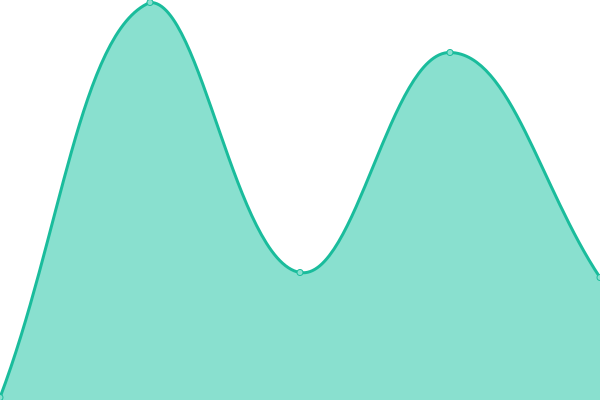

# [📈 Live Status](https://status.j-stuff.net): <!--live status--> **🟩 All systems operational**

This repository contains the open-source uptime monitor and status page for [J Stuff](https://j-stuff.net), powered by [Upptime](https://github.com/upptime/upptime).

<!--start: status pages-->
<!-- This summary is generated by Upptime (https://github.com/upptime/upptime) -->
<!-- Do not edit this manually, your changes will be overwritten -->
<!-- prettier-ignore -->
| URL | Status | History | Response Time | Uptime |
| --- | ------ | ------- | ------------- | ------ |
|  [Homepage](https://j-stuff.net/) | 🟩 Up | [homepage.yml](https://github.com/J-Stuff/status-monitor/commits/HEAD/history/homepage.yml) | 

 186ms
     
 | 

<a href="https://status.j-stuff.net/history/homepage">100.00%</a>
    

|  [CDN](https://cdn.j-stuff.net/) | 🟩 Up | [cdn.yml](https://github.com/J-Stuff/status-monitor/commits/HEAD/history/cdn.yml) | 

 108ms
     
 | 

<a href="https://status.j-stuff.net/history/cdn">99.88%</a>
    

|  Remote 1 | 🟩 Up | [remote-1.yml](https://github.com/J-Stuff/status-monitor/commits/HEAD/history/remote-1.yml) | 

 105ms
     
 | 

<a href="https://status.j-stuff.net/history/remote-1">100.00%</a>
    

|  KaspBot | 🟩 Up | [kasp-bot.yml](https://github.com/J-Stuff/status-monitor/commits/HEAD/history/kasp-bot.yml) | 

 56ms
     
 | 

<a href="https://status.j-stuff.net/history/kasp-bot">100.00%</a>
    

<!--end: status pages-->

[**Visit our status website →**](https://status.j-stuff.net)

## 📄 License

- Powered by: [Upptime](https://github.com/upptime/upptime)
- Code: [MIT](./LICENSE) © [Anand Chowdhary](https://anandchowdhary.com), supported by [Pabio](https://pabio.com)
- Data in the `./history` directory: [Open Database License](https://opendatacommons.org/licenses/odbl/1-0/)
